# AI Research Assistant

RAG-powered multi-agent research assistant built with **LangChain** + **LangGraph**.
A portfolio project demonstrating production-grade patterns for senior AI architect interviews.

## Status

- [x] Phase 1 — LangChain RAG pipeline (loader, chunker, FAISS, RetrievalQA, ConversationalChain, tool-calling agent)
- [ ] Phase 2 — LangGraph multi-agent graph (router / retriever / web / responder nodes)
- [ ] Phase 3 — FastAPI REST wrapper
- [ ] Phase 4 — GitHub Actions CI

## Architecture (target end-state)

```mermaid
flowchart TB
    Client[Client] -->|POST /query| API[FastAPI]
    API --> Graph[LangGraph StateGraph]

    subgraph Graph
        Router{Router Node<br/>intent classify}
        Retriever[Retriever Node<br/>FAISS]
        Web[Web Search Node<br/>Tavily]
        Responder[Responder Node<br/>LLM synthesis]
        Router -->|docs| Retriever
        Router -->|current events| Web
        Router -->|chitchat| Responder
        Retriever --> Responder
        Web --> Responder
    end

    Retriever -.reads.-> FAISS[(FAISS Index)]
    Ingest[POST /ingest] --> Loader[Loader + Chunker] --> Embed[OpenAI Embeddings] --> FAISS
```



## Design patterns used

Every module names the pattern it implements in a top-of-file comment. Highlights:

| Layer | Pattern |
|---|---|
| `src/config.py` | Settings Singleton (pydantic-settings) |
| `src/ingestion/loader.py` | Document Loader + Loader Registry |
| `src/ingestion/chunker.py` | Recursive Character Text Splitter |
| `src/retrieval/embeddings.py` | Factory |
| `src/retrieval/vectorstore.py` | Repository + Idempotent Build |
| `src/retrieval/rag_chain.py` | RetrievalQA Chain, Conversational Retrieval Chain w/ Memory |
| `src/agents/tool_agent.py` | Tool-Calling Agent, Retriever-as-Tool, External API Tool |

## Quick start

```bash
python3.11 -m venv .venv
source .venv/bin/activate
pip install -e ".[dev]"
cp .env.example .env   # fill in OPENAI_API_KEY + TAVILY_API_KEY
# Drop your PDFs / .txt files into data/sample_docs/
pytest                 # smoke tests, no network
```

To exercise the agent end-to-end (requires API keys + sample docs):

```python
from src.retrieval.vectorstore import get_or_build_vectorstore
from src.agents.tool_agent import build_agent

store = get_or_build_vectorstore()
agent = build_agent(store)
print(agent.invoke({"input": "Summarise the indexed documents."}))
```

## Project layout

```
src/
  config.py
  ingestion/   loader.py, chunker.py
  retrieval/   embeddings.py, vectorstore.py, rag_chain.py
  agents/      tool_agent.py
  graph/       (Phase 2)
  api/         (Phase 3)
tests/
data/sample_docs/   # drop your PDFs here (gitignored)
```

## Stack

Python 3.11+ · LangChain 0.3 · LangGraph · FAISS · OpenAI · Tavily · FastAPI · pytest · ruff
